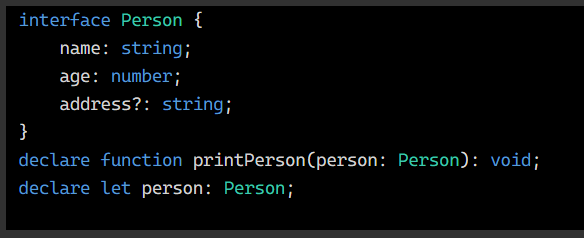
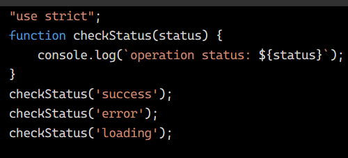
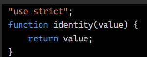
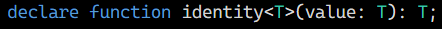
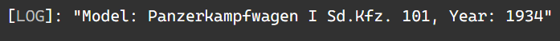

# Лабораторна робота №1
*Ознайомлення з TypeScript*

---

### Завдання 1.1:
Оголосіть змінні наступних типів: `string`, `number`, `boolean`, `array`, `object`.

*Рішення:*

### Завдання 1.2:
Створіть функцію, яка приймає як аргумент об'єкт із полями name (тип `string`) та `age` (тип `number`) і повертає рядок виду: `"Name: John, Age: 30"`.

*Рішення:*

---

### Завдання 2.1:
Оголосіть інтерфейс `Person`, який містить поля:
- `name: string`
- `age: number`
- `address?: string (опціональне поле)`

*Рішення:*

### Завдання 2.2:
Реалізуйте функцію `printPerson`, яка приймає об'єкт типу `Person` та виводить його дані у консоль.

*Рішення:*

---

### Завдання 3.1:
Оголосіть об'єднаний тип (`union type`), наприклад: 

` type Status = 'success' | 'error' | 'loading'; `

*Рішення:*

### Завдання 3.2:
Реалізуйте конструкцію (наприклад, функцію або умову), яка виводить повідомлення відповідно до значення Status.

*Рішення:*

---

### Завдання 4.1:
Реалізуйте функцію `identity<T>(value: T): T`, яка повертає передане їй значення.

*Рішення:*

### Завдання 4.2:
Використайте її для типів `number`, `string` та `boolean`.

*Рішення:*

---

### Завдання 5.1:
Реалізуйте клас `Car`, який містить поля:
- `model: string`
- `year: number`

### Завдання 5.2:
Додайте метод `getCarInfo()`, який повертає рядок виду: `"Model: Toyota, Year: 2020"`.

*Рішення:*

