## Реалізація нової сутності, створення CRUD-операцій та відповідного RESTful API
Використовуючи boilerplate-проєкт typeorm-express-typescript, який вже містить реалізацію сутності User та відповідного контролера, необхідно:

### 1. Створити нову сутність Post:
- Визначити поля:
- `id`: UUID, первинний ключ
- `title`: рядок, обов’язковий
- `content`: текст, необов’язковий
- `createdAt`: дата створення, автоматично заповнюється
- `updatedAt`: дата оновлення, автоматично оновлюється

#### entities/posts/Post.ts:
> 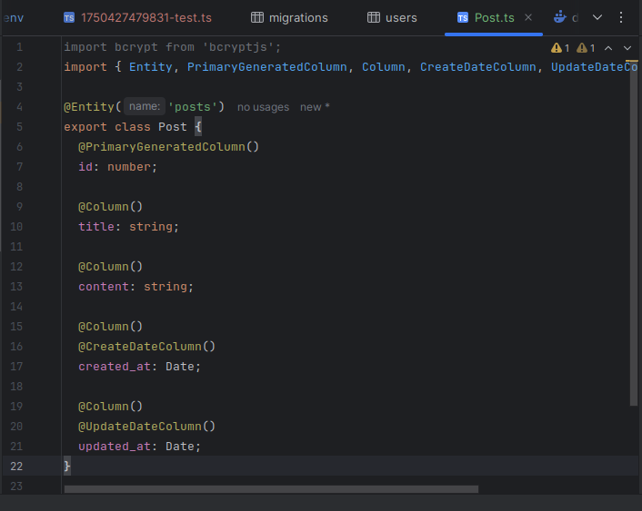

---

### 2. Створити та застосувати міграцію:
- Згенерувати міграцію для нової сутності.
  #### test migration: 
  > 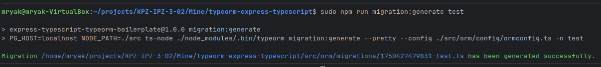

  #### test migration file:
  > 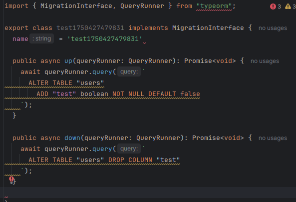

  #### post migration:
  > 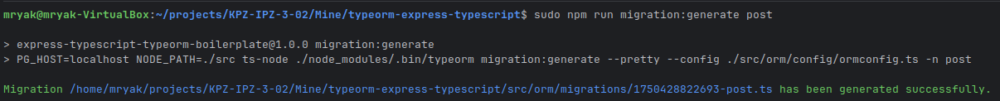

  #### post migration file:
  > 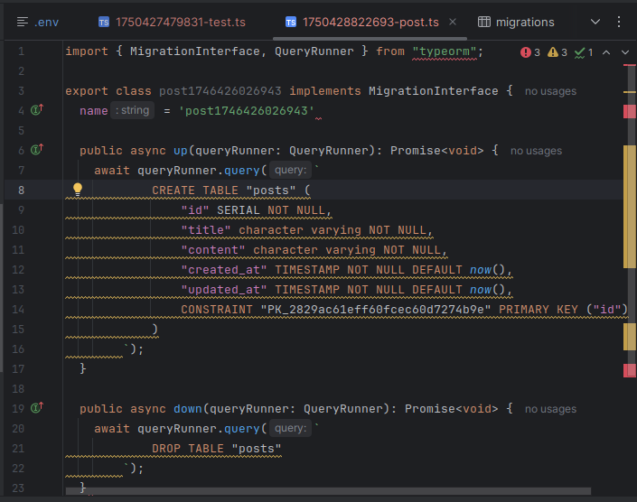

- Запустити міграцію через CLI.
  #### test migration run:
  > 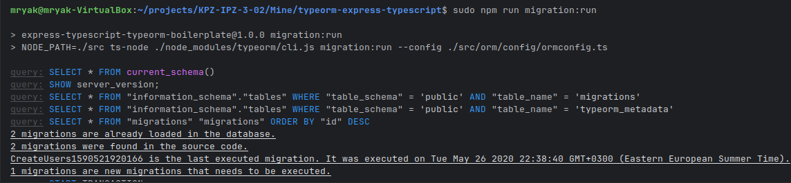

  #### post migration run:
  > 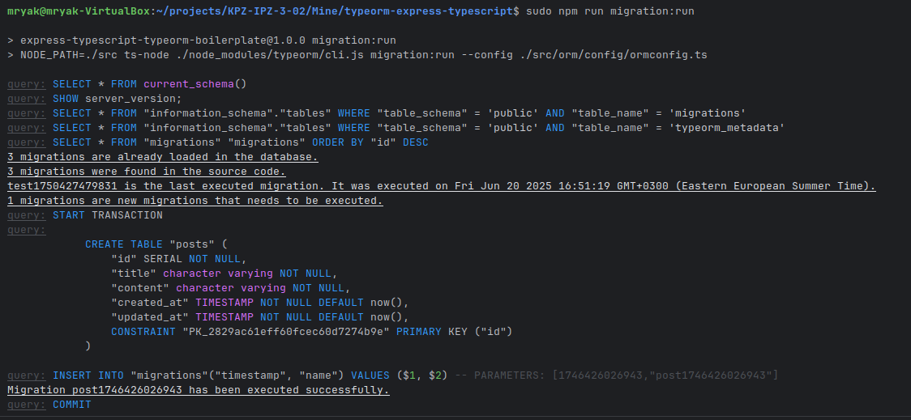

- Перевірити у базі даних (наприклад, через pgAdmin або консоль), що структура таблиці відповідає очікуваній.
  #### test users
  > 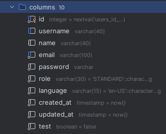

---

### 3. Реалізувати RESTful API для CRUD-операцій:
- `Create`: створення нового поста
  
  #### controllers/posts/create.ts:
  > 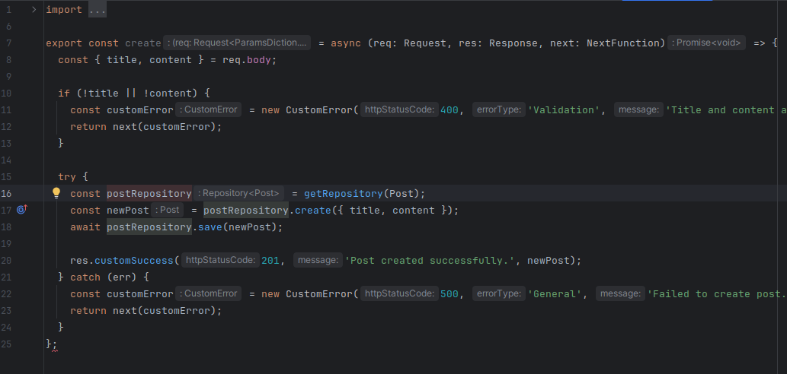

- `Read`:
  - отримання всіх постів

    #### controllers/posts/list.ts
    > 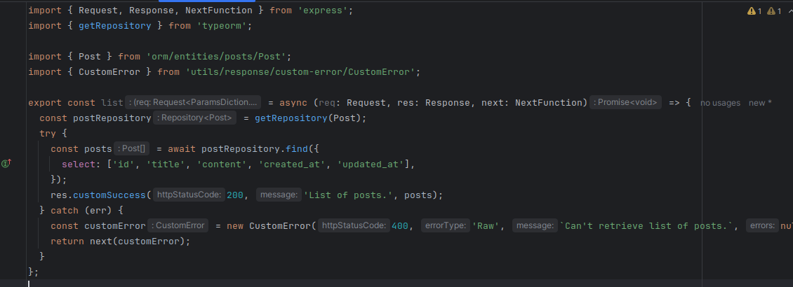

  - отримання одного поста за ID

    #### controllers/posts/show.ts
    > 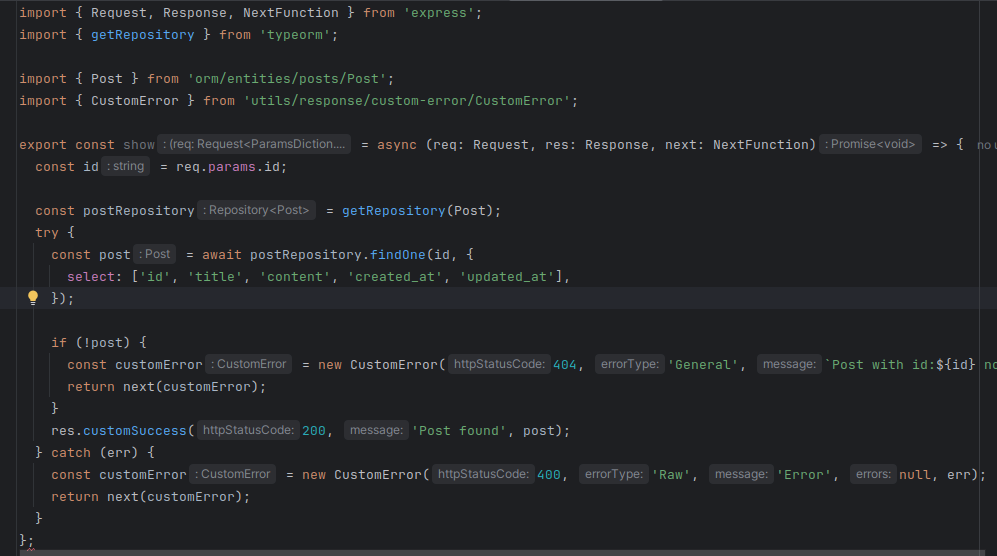

- `Update`: оновлення поста за ID

#### controllers/posts/update.ts:
> 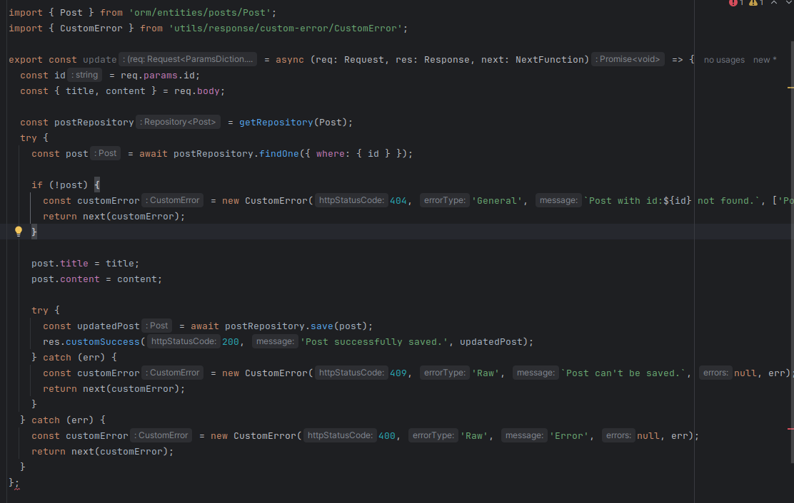

- `Delete`: видалення поста за ID

#### controllers/posts/destroy.ts
> 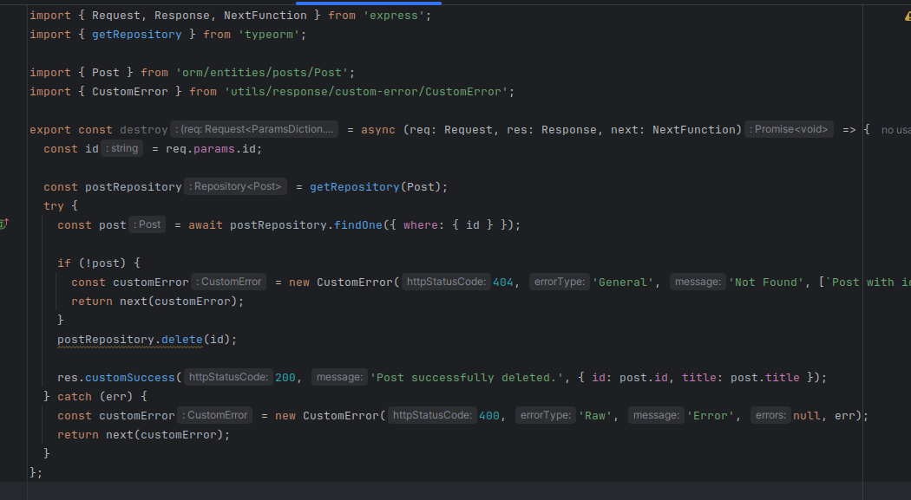

- Використовувати контролер, DTO, роутер та сервіс за прикладом реалізації для User.

##### routes/v1/posts.ts
> 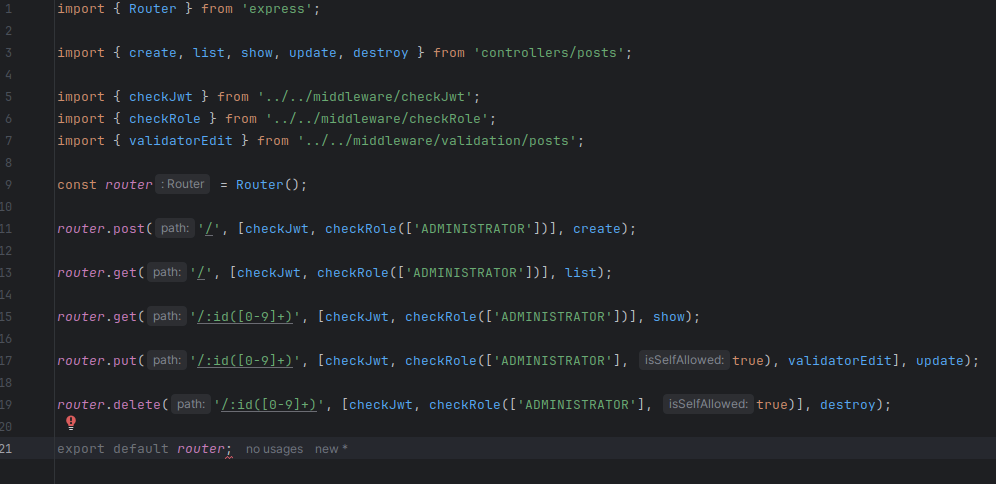

---

### 4. Протестувати REST API через Postman:
- Створити окрему колекцію для запитів.
- Додати приклади:
  - створення поста,
  
  > 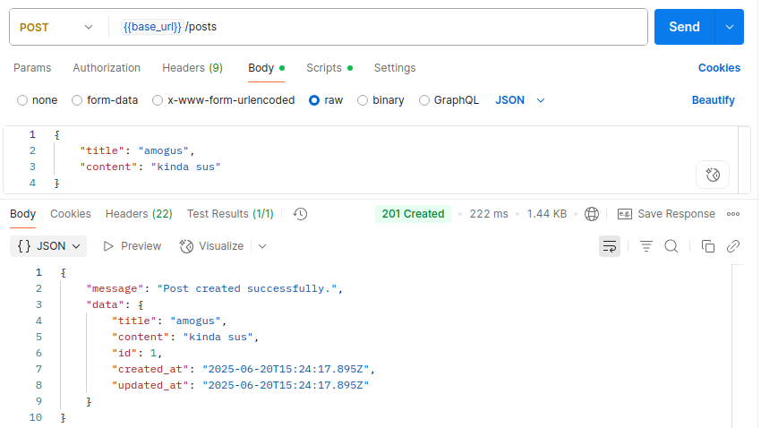
  
  - отримання всіх постів,
  
  > 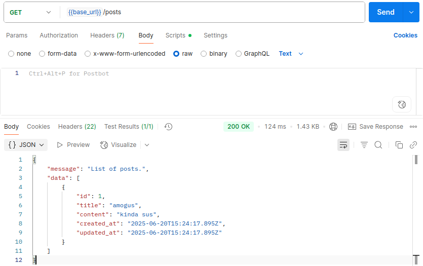
  
  - отримання поста за ID,
  
  > 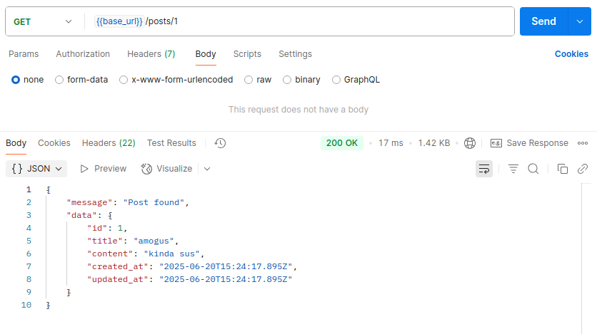
  
  - оновлення поста,
  
  > 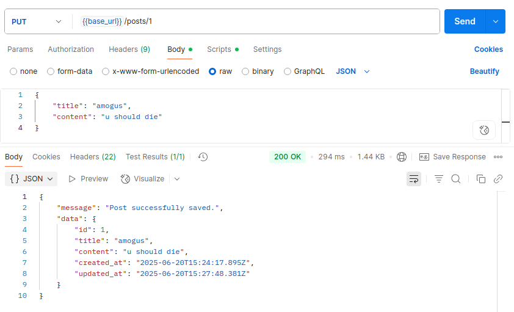
  
  - видалення поста,
  
  > 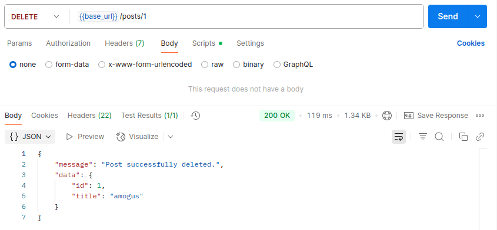
