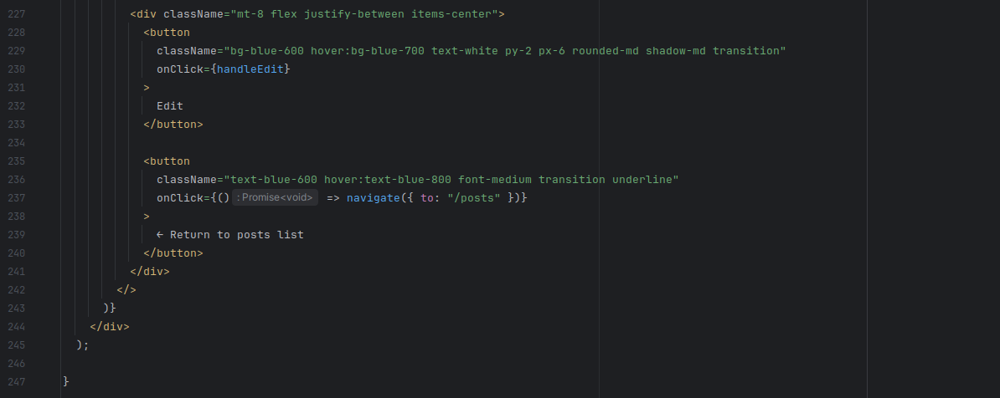
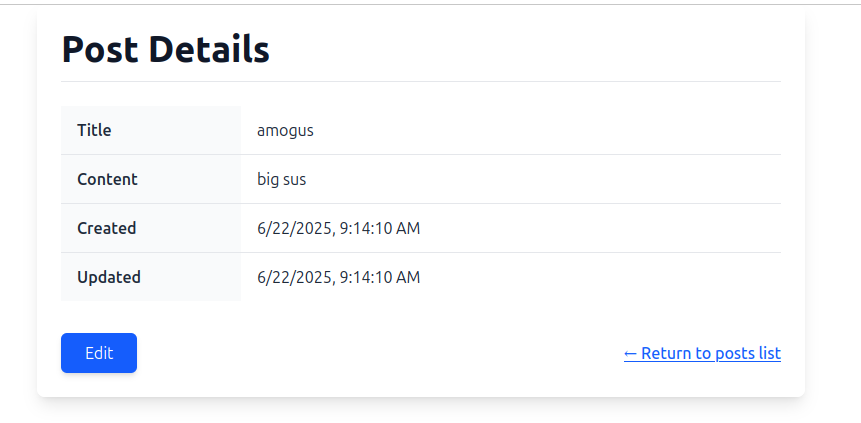

# Практично-лабораторне заняття №6
### Розробка UI для реалізації CRUD-операцій
### Мета
> Створити користувацький інтерфейс для взаємодії з реалізованим RESTful API, що надає можливість перегляду, створення, редагування та видалення екземплярів певної сутності. Розробка ведеться на базі React з використанням TanStack Router для реалізації маршрутизації.
## Завдання
> Використовуючи boilerplate-проєкт vite-react-boilerplate, для сутності Post, яка була створена в роботі “Реалізація нової сутності, створення CRUD-операцій та відповідного RESTful API”, необхідно:

### Завдання 1 & 2:
> Сторінка колекції екземплярів сутності (`/posts`)
- Реалізувати рендеринг списку всіх доступних екземплярів сутності. Для кожного елемента відображати основну інформацію (ключові поля). реалізувати: відображення повної інформації про екземпляр; можливість редагування (форма з полями);  кнопку для збереження змін (`Update`). Реалізувати можливість видалення елемента з колекції (з підтвердженням дії).

    routes:

    

    post type:

    

    post render:

    

    

    

    

    

    post delete:

    

- Передбачити можливість переходу на сторінку конкретного екземпляра (`/posts/:id`). Реалізувати: форму з порожніми полями для введення нових даних; кнопку для збереження нового екземпляра (`Create`).

    routes:

    
    
    post content render:

    

    

    

    

    

    

    

    

    post content: 

    

- Додати кнопку "Створити новий екземпляр", яка веде на маршрут `/posts/new`.

    routes:

    

    new post:

    

    

    

    

    new post render:

    

