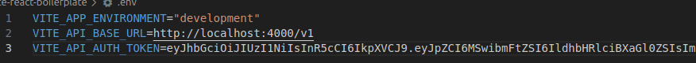
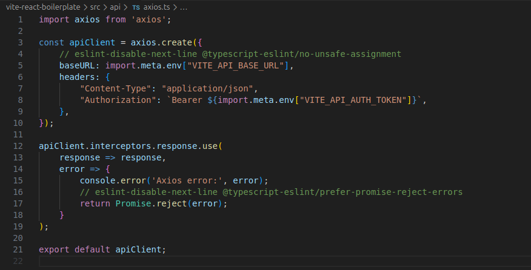

# Практично-лабораторне заняття №7
### Інтеграція клієнтської частини з RESTful API
### Мета
Підключити користувацький інтерфейс до реального серверного API. Ознайомитися з підходами до організації HTTP-запитів через Axios, зберігання токенів доступу, обробки помилок, роботи з .env-змінними. Забезпечити повноцінну взаємодію клієнтської частини з бекендом.

## Завдання
Використовуючи реалізовану у попередньому завданні клієнтську частину (інтерфейс для роботи з сутністю Post), внести такі зміни:

### Завдання 1 & 2:
Налаштування змінних оточення:
- У корені проєкту створити файл .env
- Додати до нього такі змінні:

    ```
    VITE_API_BASE_URL=http://localhost:4000/v1
    VITE_API_AUTH_TOKEN=your_jwt_token_here
    ```

    boilerplate env file content:

    

- Реалізувати використання цих змінних у конфігурації Axios

    api/axios content (для використання змінних у конфігурації Axios): Створити окремий файл (наприклад, src/api/axios.ts). Налаштувати базовий baseURL, заголовок Content-Type, токен авторизації.

    


Реалізувати обробку помилок через інтерцептор (наприклад, логування у консоль або показ повідомлення)

> реалізовано у  [лабораторнїй роботі №6](https://github.com/Jigalow-Vladimir/KPZ-IPZ-3-02/blob/main/homeworks/lab-practice-06/README.md#%D0%B7%D0%B0%D0%B2%D0%B4%D0%B0%D0%BD%D0%BD%D1%8F-1--2)

### Завдання 3:
Замінити мок-функції на реальні HTTP-запити:
- У файлі з API-функціями (src/api/posts.ts або аналогічному) замінити реалізацію:
    - getAllEntities() → GET /posts
    - getEntityById(id) → GET /posts/:id
    - createEntity(data) → POST /posts
    - updateEntity(id, data) → PUT /posts/:id
    - deleteEntity(id) → DELETE /posts/:id

> реалізовано у [лабораторнїй роботі №6](https://github.com/Jigalow-Vladimir/KPZ-IPZ-3-02/blob/main/homeworks/lab-practice-06/README.md#%D0%B7%D0%B0%D0%B2%D0%B4%D0%B0%D0%BD%D0%BD%D1%8F-1--2)

## Висновок:

У рамках лабораторного заняття №7 було здійснено повну інтеграцію клієнтської частини з RESTful API. Налаштовано змінні середовища через `.env`, реалізовано конфігурацію Axios із базовим URL та токеном авторизації. Мок-функції замінено на реальні HTTP-запити до серверу. Також налаштовано обробку помилок через інтерцептори. Усі необхідні зміни частково були реалізовані у попередній роботі.
