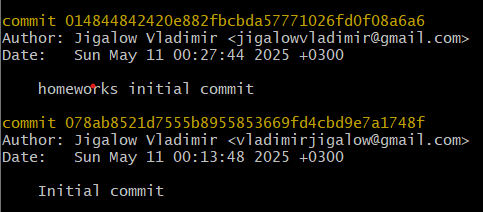
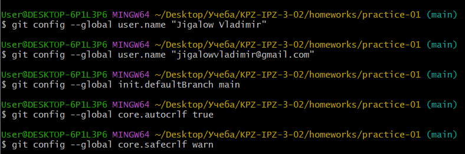
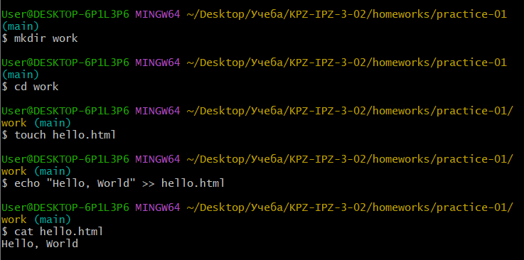
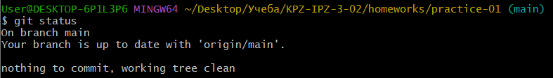
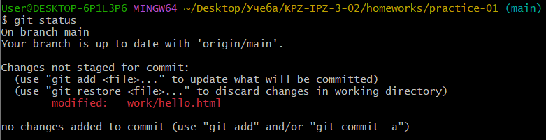
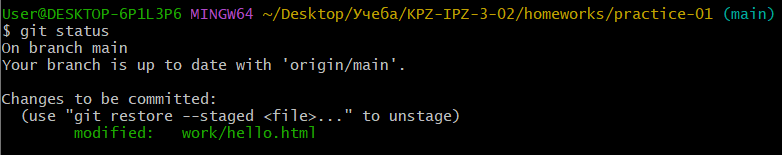

# Практичне завдання №1

Створено репозиторій для виконання практичних та лабораторних завдань.

---

Встановлено ім'я та адресу електронної пошти. Встановлено назву гілки за замовчуванням як `main`. Налаштована коректна обробка закінчень рядків.

---

Cтворено директорію `work`, а також файл `hello.html` з відповідним вмістом.

---

Перевірка стану репозиторію.

Перевірка стану після зміни контенту `hello.html`.

Перевірка стану після додавання `hello.html` до `staged`.

