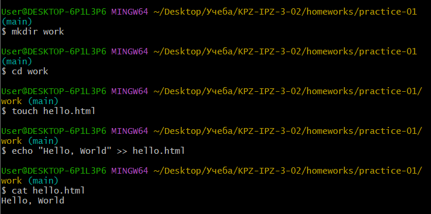
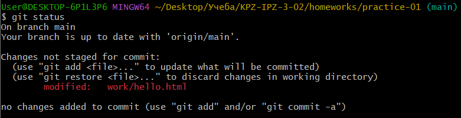

# Практичне завдання №1

Створено репозиторій для виконання практичних та лабораторних завдань.

---

Встановлено ім'я та адресу електронної пошти. Встановлено назву гілки за замовчуванням як `main`. Налаштована коректна обробка закінчень рядків.

---

Cтворено директорію `work`, а також файл `hello.html` з відповідним вмістом.

---

Перевірка стану репозиторію.

Перевірка стану після зміни контенту `hello.html`.

Перевірка стану після додавання `hello.html` до `staged`.

---

Створено файли html: a, b та c. Спочатку був створений коміт з файлами `a.html`, `b.html`, а потім комміт з файлом `c.html`.

---

Додана нова строка до файлу `a.html`. Файл додано в `stage` та створено комміт.

---

Додано базовий контент з тегами для `hello.html`. Перевірено стан репозиторію: наш файл знаходиться в `unstaged` зоні. Створюємо коміт: гіт попереджує, що потрібно спочатку додати файли до `staged`. Додаємо файл до `staged` та успішно створюємо коміт.

---

---

Робота з перевіркою старих комітів.

---

Робота з використанням тегів.

---

Скасування проіндексованих змін.

---

Скасування проіндексованих змін (перед комітом).

---

Скасування комітів.

---

Видалення комітів з гілки (revert).

---

Видалення тегу `oops`.

---

Внесення змін до комітів.

---

Створення гілки.

---

Перемикання гілок.

---

Переміщення файлів.

---

Зміни в гілці `main`.

---

Перегляд розбіжних гілок.

