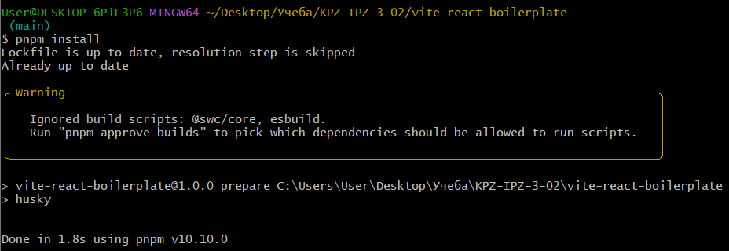
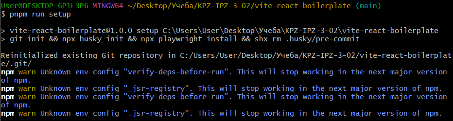
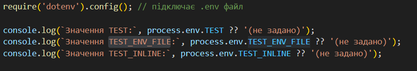
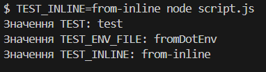

## Комплексне дослідження структури, конфігурацій та робочого середовища сучасного JavaScript-проєкту на основі бойлерплейта vite-react-boilerplate
- Познайомитись із структурою файлу package.json як центрального конфігураційного файлу JavaScript-проєкту, зрозуміти основні поля: імʼя, автор, опис, версія, ліцензія, репозиторій, скрипти та залежності.
- Вивчити принципи семантичного версіонування (SemVer) через аналіз реальних залежностей.
Ознайомитись із практикою оформлення проєктної документації (README.md).
- Вивчити призначення файлів .gitignore та LICENSE.
Розібратися з роботою гіт-хуків через аналіз артефактів, які створює бібліотека Husky.

### Завдання 1:
Початкова підготовка середовища
- Склонуйте репозиторій vite-react-boilerplate.
- Встановіть усі залежності проєкту, використовуючи команду pnpm install.
- Запустіть початковий скрипт сетапу проєкту (pnpm run setup).

*Рішення:*





---

### Завдання 2:
Аналіз структури файлу package.json
- Опишіть у звіті призначення полів файлу package.json: name, author, description, version, license, repository, scripts, dependencies, devDependencies.
- Проаналізуйте залежності, вказані у dependencies та devDependencies, поясніть логіку такої класифікації.

*Рішення:*

| Поле              | Призначення                                                                                |
| ----------------- | ------------------------------------------------------------------------------------------ |
| **`name`**        | Назва пакета: `"vite-react-boilerplate"`. Використовується в npm для ідентифікації пакета. |
| **`author`**      | Автор пакета з email: `"Ricardo Valdovinos <...>"`.                                        |
| **`description`** | Короткий опис проєкту.                                                                     |
| **`version`**     | Поточна версія: `"1.0.0"`. Дотримується [семантичного версіонування](https://semver.org/). |
| **`license`**     | Тип ліцензії: `"MIT"`. Дозволяє відкритий доступ до коду.                                  |
| **`repository`**  | Вказує на git-репозиторій проєкту.                                                         |
| **`keywords`**    | Список ключових слів для пошуку в npm.                                                     |
| **`type`**        | `"module"` — визначає тип модулів у проєкті (ESM).                                         |

---

`dependencies` (продуктивні залежності)

Ці пакети використовуються у виконанні програми:
- `React` і `ReactDOM` — основа застосунку.
- `React Hook Form`, `Zod` — форми та валідація.
- `TanStack` бібліотеки — маршрутизація, таблиці, запити.
- `i18next` — інтернаціоналізація.
- `@nivo/` — побудова графіків.
- `zustand` — керування станом.
- `dayjs` — маніпуляції з датами.

---

`devDependencies` (залежності для розробки)
- Ці пакети не потрібні у продакшн, але використовуються при розробці:
- `TypeScript`, `ts-reset`, `eslint`, `prettier` — типізація, лінтинг, автоформатування.
- `Storybook` — ізольоване тестування UI-компонентів.
- `Vitest`, `Playwright`, `Testing Library` — юніт- і e2e-тестування.
- `TailwindCSS`, `PostCSS`, `autoprefixer` — стилізація.
- `Commitizen`, `commitlint`, `husky` — стандартизація комітів.
- `faker`, `jsdom` — для генерації тестових даних і DOM-оточення.
- `vite`, `vite-plugin-static-copy` — інструменти для збирання.

---

### Завдання 3:
Семантичне версіонування (SemVer)
- Ознайомтесь із принципами SemVer.
- Дослідіть версії пакетів бойлерплейту. Поясніть, які оновлення (мажорні, мінорні, патчі) допускаються відповідно до версій, зазначених у файлі package.json.

*Рішення:*

Більшість пакетів вказані з префіксом `^`, наприклад:
```"react": "^18.3.1"```

---

### Завдання 4:
Дослідження додаткових конфігураційних файлів
- Проаналізуйте та опишіть призначення, структуру та важливі елементи файлів:
    - README.md
    - .gitignore
    - LICENSE

*Рішення:*

1. Файл `README.md` використовується як основна документація проєкту. Його бачать першими користувачі `GitHub`-репозиторію. Він пояснює, що це за проєкт, як його встановити, запускати, використовувати та розробляти.
2. Файл `.gitignore` вказує `Git`, які файли чи папки слід ігнорувати при додаванні до репозиторію. Це дозволяє уникнути включення конфіденційних даних, скомпільованих файлів або тимчасових файлів розробника.
3. Файл `LICENSE` визначає правові умови використання проєкту іншими розробниками. Він гарантує, що користувачі знають, що їм дозволено робити з кодом.

---

### Завдання 5:
Аналіз роботи гіт-хуків Husky
- Дослідіть артефакти, які створюються після встановлення та налаштування бібліотеки Husky.
Опишіть, для чого потрібні ці артефакти, як вони налаштовуються та яку роль відіграють у процесі розробки.

*Рішення:*

`Husky` — це інструмент для налаштування `Git`-хуків (`hooks`) у `JavaScript`/`TypeScript`-проєктах. Він дозволяє автоматизувати перевірки коду (наприклад, лінтинг, тести, форматування) перед комітом, пушем або іншими діями в `Git`.

---

.husky/ — директорія хуків

Містить окремі файли-хуки, наприклад:
- **`.husky/pre-commit`**
> Файл із shell-скриптом, який запускається перед виконанням коміту.
- **`.husky/commit-msg`**
> Цей хук викликається після написання коментаря до коміту.
- **`.husky/pre-push`**
> Може запускати повні тести перед пушем.

---

### Завдання 6:
Використання змінних оточення
- Напишіть скрипт, який буде читати довільну змінну оточення та друкувати її значення у консоль.
- Задайте різне значення змінної оточення на різних рівнях (ОС, сесія терміналу, окремий запуск скрипта, dotEnv файл) та дослідіть пріоритетність їх застосування.
- Зафіксуйте отримані результати. 

*Рішення:*



